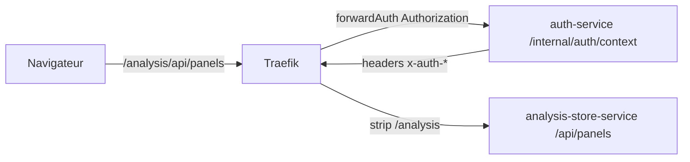

# Architecture infrastructure

## Objectif du document
Décrire l'infrastructure réellement orchestrée par le repo `infra` : Docker Compose, Traefik, réseaux, ports, bases de données, observabilité et mécanisme de déploiement VPS.

## Rôle du repo infra
Le repo `infra` est la source de déploiement de la stack Action Board. Il contient :

- `docker-compose.yml` : services, réseaux, volumes, healthchecks, labels Traefik.
- `.env.example` : variables attendues pour les images, domaines, secrets et ports.
- `traefik/traefik.yml` : entrypoints HTTP/HTTPS, Docker provider, Let's Encrypt, métriques.
- `observability/` : configuration Prometheus, provisioning Grafana et dashboards.
- `rabbitmq/` : activation du plugin Prometheus RabbitMQ.
- `scripts/vps/` : scripts de déploiement restreint côté VPS.
- `.github/workflows/deploy-prod.yml` : workflow GitHub Actions qui demande un déploiement au VPS.

## Compose : services
| Service Compose | Image | Rôle | Dépendances |
|---|---|---|---|
| `traefik` | `traefik:latest` | Reverse proxy, TLS, discovery Docker, metrics | Docker socket |
| `front-service` | `${FRONT_IMAGE}` | Front Angular SSR | Traefik |
| `auth-service` | `${AUTH_IMAGE}` | Authentification et identité | `mongo`, `rabbitmq` |
| `analysis-store-service` | `${ANALYSIS_STORE_IMAGE}` | Stockage timelines/panels | `analysis-store-migrate`, `postgres`, `rabbitmq` |
| `analysis-store-migrate` | `${ANALYSIS_STORE_IMAGE}` | Migration Drizzle one-shot | `postgres` |
| `mongo` | `mongo:7.0.18` | Base auth | Volume `mongo-data` |
| `postgres` | `postgres:16-alpine` | Base analysis-store | Volume `postgres-data` |
| `rabbitmq` | `rabbitmq:3-management` | Broker événements domaine + management local | Volume `rabbitmq-data` |
| `prometheus` | `prom/prometheus:v2.55.1` | Scrape metrics | `prometheus-data` |
| `grafana` | `grafana/grafana:11.5.2` | Dashboards | Prometheus |
| `uptime-kuma` | `louislam/uptime-kuma:2` | Uptime / status page | Traefik |

## Réseau et volumes
Le Compose définit un seul réseau :

```yaml
networks:
  backend:
    name: infra-backend
```

Tous les conteneurs de la stack y sont connectés. Les volumes persistants sont :

| Volume | Usage |
|---|---|
| `mongo-data` | Données MongoDB auth |
| `postgres-data` | Données PostgreSQL analysis-store |
| `rabbitmq-data` | État RabbitMQ |
| `prometheus-data` | Séries Prometheus |
| `grafana-data` | État Grafana |
| `uptime-kuma-data` | Configuration et historique Uptime Kuma |

## Exposition réseau
| Service | Publication hôte | Port interne | Commentaire sécurité |
|---|---|---:|---|
| Traefik HTTP | `${TRAEFIK_WEB_PORT:-80}:80` | `80` | Entrée publique |
| Traefik HTTPS | `${TRAEFIK_WEBSECURE_PORT:-443}:443` | `443` | Entrée publique TLS |
| Traefik dashboard | `127.0.0.1:${TRAEFIK_DASHBOARD_PORT:-8080}:8080` | `8080` | Local VPS uniquement |
| Prometheus | `127.0.0.1:${PROMETHEUS_PORT:-9090}:9090` | `9090` | Local VPS uniquement |
| Grafana | `127.0.0.1:${GRAFANA_PORT:-3003}:3000` | `3000` | Local VPS uniquement |
| RabbitMQ AMQP | `127.0.0.1:${RABBITMQ_AMQP_PORT:-5672}:5672` | `5672` | Local VPS + interne |
| RabbitMQ management | `127.0.0.1:${RABBITMQ_MANAGEMENT_PORT:-15672}:15672` | `15672` | Local VPS uniquement |
| MongoDB | Non publié | `27017` | Interne Docker |
| PostgreSQL | Non publié | `5432` | Interne Docker |
| Front/Auth/Analysis | Non publiés directement | `4000`/`3000`/`3001` | Accès via Traefik |
| Uptime Kuma | Non publié directement | `3001` | Accès via Traefik sur `UPTIME_KUMA_DOMAIN` |

## Routage Traefik
| Route publique | Router | Service cible | Middleware | Priorité |
|---|---|---|---|---:|
| `/` | `front`, `front-secure` | `front-service:4000` | Aucun | `1` |
| `/auth`, `/users`, `/me`, `/health` | `auth`, `auth-secure` | `auth-service:3000` | Aucun | `100` |
| `/analysis` | `analysis-store`, `analysis-store-secure` | `analysis-store-service:3001` | sanitize headers, forwardAuth, strip prefix | `90` |
| `Host(UPTIME_KUMA_DOMAIN)` | `uptime-kuma`, `uptime-kuma-secure` | `uptime-kuma:3001` | Aucun | `110` |

Pour `analysis-store-service`, Traefik supprime le préfixe `/analysis`. Le front appelle donc `/analysis/api/timelines`, tandis que le service reçoit `/api/timelines`.



## Healthchecks Docker
| Service | Test Compose | Fréquence |
|---|---|---|
| `front-service` | HTTP `127.0.0.1:4000/healthz` | `30s`, retries `5` |
| `auth-service` | HTTP `127.0.0.1:3000/health` | `15s`, retries `10` |
| `analysis-store-service` | HTTP `127.0.0.1:3001/api/health` | `15s`, retries `10` |
| `mongo` | `mongosh ... db.adminCommand({ ping: 1 })` | `10s`, retries `10` |
| `postgres` | `pg_isready` | `10s`, retries `10` |
| `rabbitmq` | `rabbitmq-diagnostics -q ping` | `10s`, retries `10` |

## Observabilité
Prometheus scrape les targets suivantes :

| Job | Target | Endpoint |
|---|---|---|
| `prometheus` | `localhost:9090` | Prometheus interne |
| `front-service` | `front-service:4000` | `/metrics` |
| `auth-service` | `auth-service:3000` | `/metrics` |
| `analysis-store-service` | `analysis-store-service:3001` | `/metrics` |
| `traefik` | `traefik:8080` | `/metrics` |
| `rabbitmq` | `rabbitmq:15692` | `/metrics` |

Grafana provisionne automatiquement la datasource Prometheus et les dashboards présents dans `observability/grafana/dashboards`. Uptime Kuma surveille plutôt la disponibilité fonctionnelle avec des checks HTTP vers les endpoints de health.

## Images GHCR
`.env.example` référence actuellement les images complètes :

```env
FRONT_IMAGE=ghcr.io/tristanynov/front-service:prod
AUTH_IMAGE=ghcr.io/tristanynov/auth-service:prod
ANALYSIS_STORE_IMAGE=ghcr.io/tristanynov/analysis-store-service:prod
```

Le Compose ne reconstruit pas les services applicatifs : il tire les images indiquées. En production, les tags versionnés ou digests sont préférables :

```env
FRONT_IMAGE=ghcr.io/<owner>/front-service:1.4.2
AUTH_IMAGE=ghcr.io/<owner>/auth-service@sha256:<digest>
ANALYSIS_STORE_IMAGE=ghcr.io/<owner>/analysis-store-service:1.4.2
```

## Déploiement VPS
Le chemin serveur attendu par le script est :

```bash
/opt/actionboard/infra
```

Le workflow GitHub Actions `deploy-prod.yml` appelle le VPS en SSH avec une commande restreinte :

```bash
deploy-service front-service
deploy-service auth-service
deploy-service analysis-store-service
deploy-service all
```

Le wrapper `actionboard-deploy-wrapper` refuse toute autre commande. Le script `actionboard-deploy-service` :

1. prend un lock pour éviter deux déploiements simultanés ;
2. fait `git fetch origin prod` puis `git pull --ff-only origin prod` ;
3. valide `docker compose config` ;
4. tire et redémarre le service ciblé ;
5. lance les migrations avant `analysis-store-service` ;
6. affiche `docker compose ps`.

## Sécurité d'exploitation
- Les secrets réels doivent rester dans `.env` sur le VPS, jamais dans Git.
- Les ports sensibles sont liés à `127.0.0.1` ou non publiés.
- Traefik est le seul point d'entrée public applicatif.
- Les bases de données sont internes au réseau Docker.
- Le dashboard Traefik est activé mais lié à `127.0.0.1`; ne pas l'exposer publiquement.
- Les credentials Grafana, RabbitMQ, DB et JWT doivent être remplacés par des valeurs fortes sur le VPS.

## Points de vigilance
- `traefik/traefik.yml` contient un email Let's Encrypt statique. Vérifier la cohérence avec la valeur souhaitée en production.
- `auth-service` active CORS pour `http://localhost:4200`; en production, les appels passent normalement en same-origin via Traefik.
- Les routes `/admin/*` ne sont pas publiées par Traefik malgré leur existence dans le code.
- `uptime-kuma` n'a pas de mapping hôte direct dans le Compose actuel : l'accès passe par le domaine `UPTIME_KUMA_DOMAIN`.
