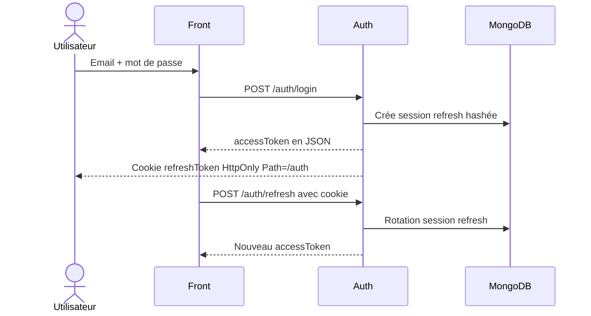
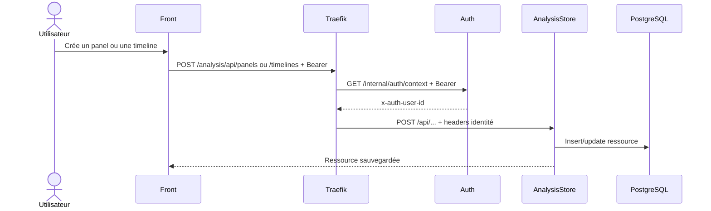

# Architecture logicielle

## Objectif du document
Décrire l'architecture applicative actuelle d'Analyse Basket / Action Board : responsabilités logicielles, domaines fonctionnels, sécurité et contrats entre le front, l'authentification et le stockage métier.

## Vue applicative
L'application est découpée en trois services applicatifs derrière Traefik :

| Couche | Service | Responsabilités | Persistance |
|---|---|---|---|
| Interface | `front-service` | Routes Angular, SSR, lecteur vidéo, timeline, panels, sauvegarde/import/export côté UX | Pas de persistance serveur directe |
| Identité | `auth-service` | Création utilisateur, login, refresh, logout, `/me`, rôles, sessions, suppression utilisateur | MongoDB |
| Métier analyse | `analysis-store-service` | Timelines, panels, imports, exports, copie, visibilité, ownership | PostgreSQL |
| Gateway | Traefik | Routage public, TLS, forward auth, sanitation des headers identité | Configuration Docker labels |

## Frontend
Le front est une application Angular SSR. Les routes observées sont :

| Route front | Statut | Remarque |
|---|---|---|
| `/` | Public | Landing page |
| `/fonctionnalites`, `/tarifs`, `/faq`, `/contact`, `/cgu`, `/confidentialite` | Public | Pages d'information |
| `/welcome` | Protégée | Accueil après connexion |
| `/analyse` | Protégée | Nécessite `authGuard` et `licenseGuard` |
| `/club`, `/teams`, `/players`, `/tournaments`, `/matchs` | Protégées | Composant indisponible actuellement |

Le serveur SSR Express expose aussi :

| Endpoint | Usage |
|---|---|
| `/healthz` | Healthcheck front |
| `/metrics` | Métriques Prometheus |
| `/runtime-config.js` | Configuration runtime injectée côté navigateur |

## Fonctionnalités utilisateur constatées
| Fonction | Présence actuelle | Source |
|---|---|---|
| Connexion / inscription | Oui | `AuthApiService`, `AuthSessionService` |
| Refresh de session | Oui, cookie refresh HttpOnly | `auth-service/AuthController` |
| Vidéo locale | Oui, chargée depuis un fichier navigateur | `VideoDisplayComponent`, `VideoService` |
| Timeline | Oui | Store `Timeline`, `TimelineFacadeService` |
| Panels | Oui | `SequencerPanelService`, API panels |
| Events / labels / stats | Oui | Interfaces sequencer et composants de création |
| Drag / resize du layout | Oui, directives dédiées | `cdk-drag-resize.directive.ts`, `cdk-resizable.directive.ts` |
| Sauvegarde timeline/panel | Oui | `AnalysisStoreEffects`, `AnalysisStoreApi` |
| Import / validation | Oui | `/analysis/api/imports/.../validate` |
| Export JSON local | Oui | Effets `analysisStoreExportPanel`, `analysisStoreExportTimeline` |
| Copie de panel distant | Oui | `POST /api/panels/:id/copy` |
| Panels publics/privés | Oui, modèle `private`, `club`, `public` | `analysis-store-service` |
| Timelines publiques | Non en usage front documenté ; timelines traitées comme privées | i18n front, règles d'accès owner |
| Anonymisation | Partielle côté ressources via flag `hasAnonymizedContent` et boutons anonymisés | front mappers, DB schema |
| Club/team/player/match | Prévu ou indisponible côté UI actuelle | routes vers `ServiceUnavailableComponent` |

## API auth-service
| Méthode | Route | Protection | Usage |
|---|---|---|---|
| `POST` | `/users` | Public | Créer un compte utilisateur |
| `POST` | `/auth/login` | Local strategy | Login, création session refresh, retour access token |
| `POST` | `/auth/refresh` | Cookie refresh | Rotation du refresh token, retour access token |
| `POST` | `/auth/logout` | Cookie refresh si présent | Révocation de session |
| `GET` | `/auth/sessions` | JWT | Lister les sessions utilisateur |
| `DELETE` | `/auth/sessions/:id` | JWT | Révoquer une session |
| `DELETE` | `/auth/sessions` | JWT | Révoquer toutes les sessions |
| `GET` | `/me` | JWT + rôle `user` | Profil courant |
| `PATCH` | `/me` | JWT + rôle `user` | Mise à jour profil |
| `DELETE` | `/me` | JWT + rôle `user` | Démarrer le workflow de suppression |
| `GET` | `/admin/users` | JWT + rôle `admin` | Lister les utilisateurs |
| `PATCH` | `/admin/users/:id` | JWT + rôle `admin` | Modifier un utilisateur |
| `DELETE` | `/admin/users/:id` | JWT + rôle `admin` | Suppression admin via workflow |
| `GET` | `/internal/auth/context` | JWT | Forward auth Traefik, headers identité |
| `GET` | `/health` | Public | Healthcheck |
| `GET` | `/metrics` | Public interne réseau | Metrics Prometheus |

> Les labels Traefik actuels exposent publiquement `/auth`, `/users`, `/me` et `/health`. Les routes `/admin/*` existent dans le code mais ne sont pas exposées par le routage public Compose actuel.

## API analysis-store-service
Le service utilise un préfixe global `/api`, sauf `/metrics`.

| Méthode | Route interne | Route publique via Traefik | Protection | Usage |
|---|---|---|---|---|
| `GET` | `/api/health` | `/analysis/api/health` | Non critique | Healthcheck |
| `GET` | `/metrics` | Non routée publiquement par `/analysis` | Réseau Docker | Metrics Prometheus |
| `POST` | `/api/imports/timelines/validate` | `/analysis/api/imports/timelines/validate` | Non gardée dans le contrôleur | Validation import timeline |
| `POST` | `/api/imports/panels/validate` | `/analysis/api/imports/panels/validate` | Non gardée dans le contrôleur | Validation import panel |
| `GET` | `/api/timelines` | `/analysis/api/timelines` | Header identité | Lister les timelines accessibles |
| `POST` | `/api/timelines` | `/analysis/api/timelines` | Header identité | Créer une timeline |
| `GET` | `/api/timelines/:id` | `/analysis/api/timelines/:id` | Header identité | Lire une timeline |
| `GET` | `/api/timelines/:id/export` | `/analysis/api/timelines/:id/export` | Header identité | Exporter une timeline |
| `PATCH` | `/api/timelines/:id` | `/analysis/api/timelines/:id` | Header identité | Modifier une timeline |
| `DELETE` | `/api/timelines/:id` | `/analysis/api/timelines/:id` | Header identité | Supprimer une timeline |
| `GET` | `/api/panels` | `/analysis/api/panels` | Header identité | Lister les panels accessibles |
| `POST` | `/api/panels` | `/analysis/api/panels` | Header identité | Créer un panel |
| `GET` | `/api/panels/:id/export` | `/analysis/api/panels/:id/export` | Header identité | Exporter un panel |
| `PATCH` | `/api/panels/:id` | `/analysis/api/panels/:id` | Header identité | Modifier un panel |
| `DELETE` | `/api/panels/:id` | `/analysis/api/panels/:id` | Header identité | Supprimer un panel |
| `POST` | `/api/panels/:id/copy` | `/analysis/api/panels/:id/copy` | Header identité | Copier un panel accessible |
| `GET` | `/api/security/context` | `/analysis/api/security/context` | Header identité | Debug contexte identité |
| `POST` | `/api/security/access-check/timeline` | `/analysis/api/security/access-check/timeline` | Header identité | Vérification accès timeline |
| `POST` | `/api/security/access-check/panel` | `/analysis/api/security/access-check/panel` | Header identité | Vérification accès panel |

## Modèle d'accès métier
Les timelines sont contrôlées par ownership : un utilisateur accède à ses propres timelines. Les panels supportent trois visibilités :

| Visibilité | Règle |
|---|---|
| `private` | Accès propriétaire uniquement |
| `public` | Accès par tout utilisateur authentifié |
| `club` | Prévu par le modèle, nécessite un `clubId` et des `clubIds` dans le contexte identité |

Le modèle `club` existe côté code et base, mais les `clubIds` ne sont pas alimentés par le JWT actuel. À utiliser avec prudence tant que le domaine club n'est pas finalisé.

## Authentification et tokens

## Flux de sauvegarde analyse

## Suppression utilisateur et événements
`auth-service` et `analysis-store-service` utilisent RabbitMQ pour propager les événements liés à la suppression utilisateur. Les deux services exposent aussi des métriques métier RabbitMQ consommées par Prometheus/Grafana.

## Maintenabilité
- Les services applicatifs sont publiés indépendamment sur GHCR.
- Le repo `infra` choisit les images via variables `.env`.
- `analysis-store-migrate` réutilise l'image `analysis-store-service` et exécute `npm run db:migrate`.
- Les contrats de déploiement sont documentés dans `docs/contracts/*`.

## Limites et points à confirmer
- Les écrans club/team/player/match sont présents dans le routing mais affichent un état indisponible.
- Les routes admin existent dans `auth-service`, mais ne sont pas publiées par Traefik dans le Compose de référence.
- L'anonymisation est représentée dans les données et certains écrans, mais doit être validée fonctionnellement à chaque évolution d'UX.
