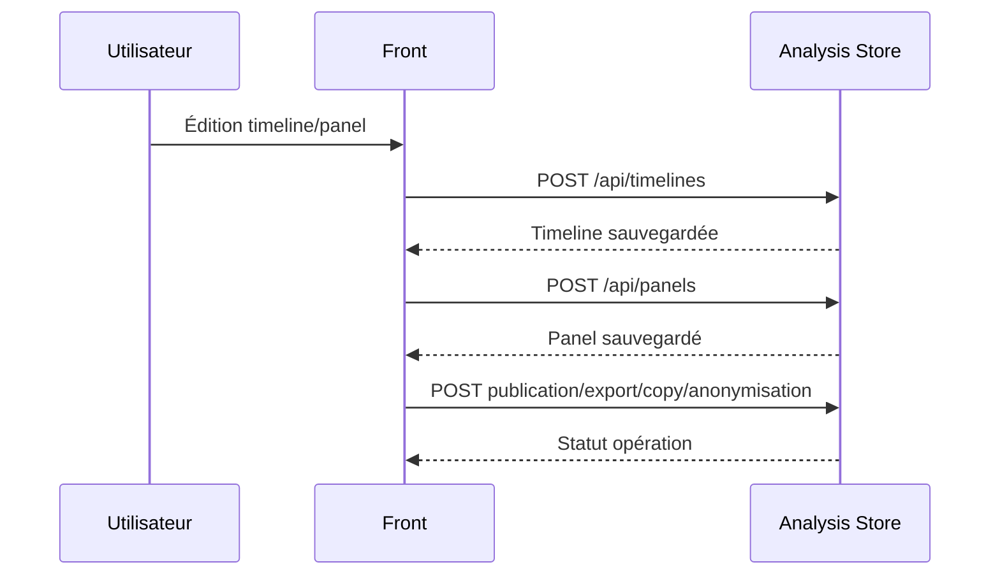

# Flux analysis-store

## Objectif du document
Documenter les opérations de sauvegarde et diffusion d’analyse.

## Séquence simplifiée

## Points de vigilance
- Ownership des ressources.
- Traçabilité publication/anonymisation.
