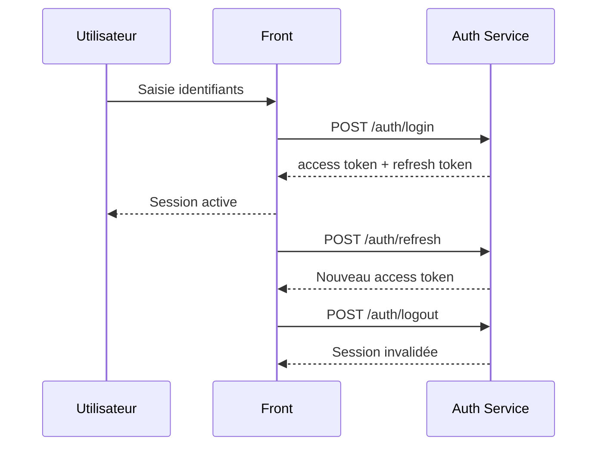

# Flux authentification

## Objectif du document
Décrire le cycle login/access token/refresh/logout.

## Séquence simplifiée

## Contrôles
- Rôles utilisateur/admin.
- Expiration des tokens.
- Gestion des sessions: À compléter.
