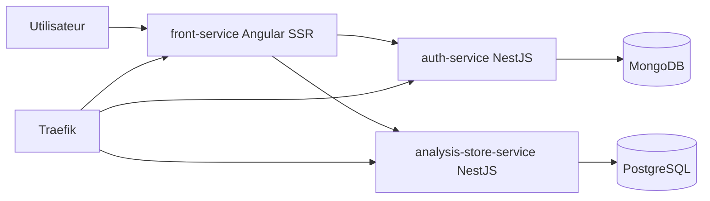

# Vue d’ensemble

## Objectif du document
Présenter les composants majeurs et leurs interactions.

## Diagramme de contexte

## Services
- `front-service` : UI SSR, port interne 4000, healthcheck `/healthz`.
- `auth-service` : auth JWT/refresh + rôles, MongoDB, healthcheck `/health`.
- `analysis-store-service` : timelines/panels via `/api/...`, PostgreSQL, healthcheck `/api/health`, exposition `/analysis`.
- `infra` : Docker Compose, Traefik, GHCR, Uptime Kuma.
