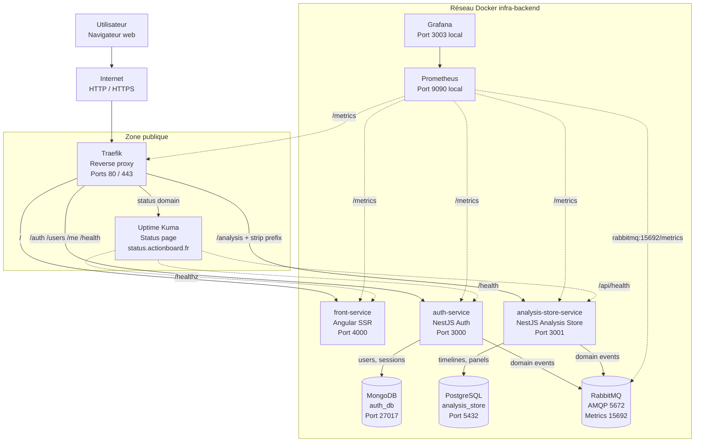
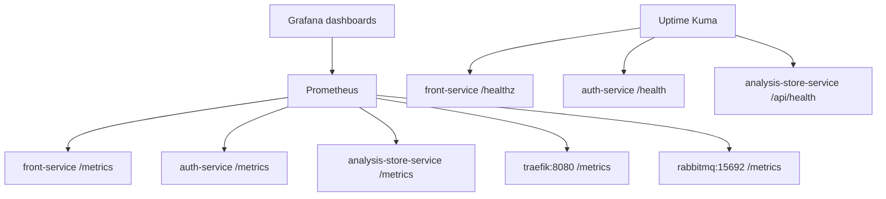
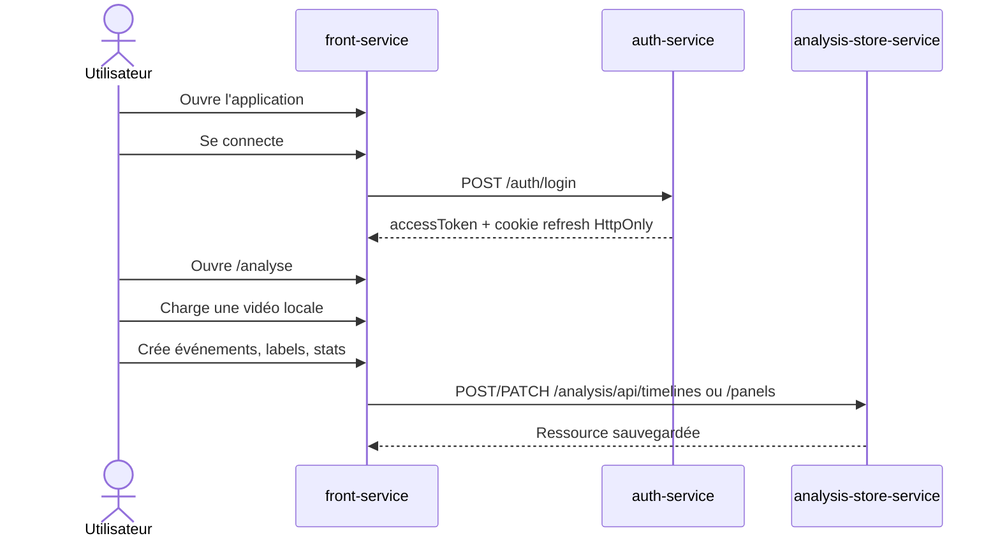
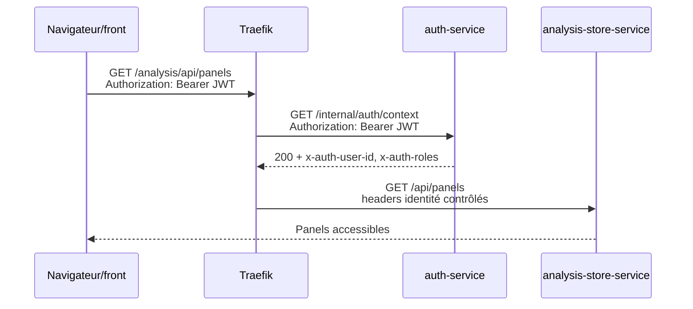
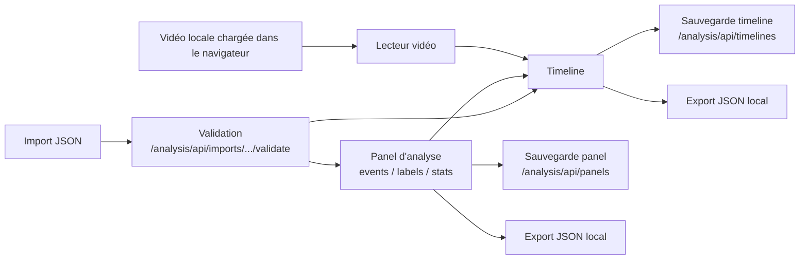
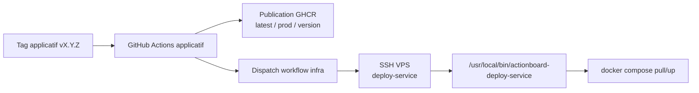

# Vue d'ensemble

## Objectif du document
Présenter la vision globale actuelle d'Analyse Basket / Action Board, le rôle du repo `infra`, les responsabilités des services applicatifs et les flux techniques observés dans le code.

## Vision globale
Action Board est une application web d'analyse vidéo sportive. Elle permet à un utilisateur connecté de charger une vidéo locale dans son navigateur, de structurer son observation avec une timeline, de créer des panels d'analyse, puis de sauvegarder, importer ou exporter ces ressources.

Le repo `infra` ne contient pas la logique métier applicative. Il orchestre l'exécution de la stack avec Docker Compose, centralise les variables d'images, configure Traefik, lance les bases de données, RabbitMQ et l'observabilité.

| Service | Rôle actuel | Exposition |
|---|---|---|
| `front-service` | Interface Angular SSR, parcours utilisateur, page d'analyse vidéo, appels API | Public via Traefik sur `/` |
| `auth-service` | Comptes, login, refresh token, JWT, rôles, contexte d'identité | Public via Traefik sur `/auth`, `/users`, `/me`, `/health` |
| `analysis-store-service` | Persistance PostgreSQL des timelines et panels, import/export, règles d'accès | Public via Traefik sur `/analysis`, protégé par forward auth |
| `infra` | Compose, réseau Docker, Traefik, Prometheus, Grafana, Uptime Kuma, RabbitMQ | Repo d'exploitation |
| `mongo` | Données auth et sessions de refresh | Interne Docker uniquement |
| `postgres` | Données timelines, panels, outbox/processed events | Interne Docker uniquement |
| `rabbitmq` | Événements de domaine, notamment suppression utilisateur | Ports hôte liés à `127.0.0.1`, usage applicatif interne |

## Technologies utilisées
| Composant | Technologie vérifiée | Version / détail | Source |
|---|---|---|---|
| Frontend | Angular SSR, Angular Material, NgRx, Express | Angular `^21.2.x`, Node 22, port `4000` | `front-service/package.json`, `Dockerfile`, `src/server.ts` |
| Auth service | NestJS, Passport, JWT, Mongoose, bcrypt | NestJS `^10`, MongoDB, port `3000` | `auth-service/package.json`, contrôleurs |
| Analysis store service | NestJS, Drizzle ORM, PostgreSQL | NestJS `^11.1`, PostgreSQL, port `3001` | `analysis-store-service/package.json`, `src/main.ts` |
| MongoDB | Image Docker officielle | `mongo:7.0.18` | `infra/docker-compose.yml` |
| PostgreSQL | Image Docker officielle | `postgres:16-alpine` | `infra/docker-compose.yml` |
| Reverse proxy | Traefik | `traefik:latest`, entrypoints `80`/`443`, Let's Encrypt HTTP challenge | `infra/docker-compose.yml`, `traefik/traefik.yml` |
| Monitoring | Prometheus, Grafana | Prometheus `v2.55.1`, Grafana `11.5.2` | `infra/docker-compose.yml` |
| Uptime | Uptime Kuma | Image `louislam/uptime-kuma:2`, domaine dédié | `infra/docker-compose.yml` |
| Messaging | RabbitMQ management + Prometheus plugin | `rabbitmq:3-management`, metrics internes `15692` | `rabbitmq/rabbitmq.conf`, `enabled_plugins` |
| Images | GHCR | Variables `FRONT_IMAGE`, `AUTH_IMAGE`, `ANALYSIS_STORE_IMAGE` | `.env.example`, workflows applicatifs |
| CI/CD | GitHub Actions | publication SemVer `vX.Y.Z`, tags `latest`, `prod`, version sans `v`, dispatch infra | workflows `.github` |

## Architecture globale

## Protocoles et communications interservices
| Source | Destination | Protocole | Route / Port | Usage | Exposition |
|---|---|---|---|---|---|
| Navigateur | Traefik | HTTP / HTTPS | `80`, `443` | Entrée publique application | Public |
| Traefik | `front-service` | HTTP | `front-service:4000` | SSR, assets, routes front | Interne Docker |
| Navigateur / front | `auth-service` via Traefik | REST HTTP(S) | `/auth/login`, `/auth/refresh`, `/auth/logout`, `/users`, `/me` | Compte, login, session | Public via Traefik |
| Navigateur / front | `analysis-store-service` via Traefik | REST HTTP(S) | `/analysis/api/...` | Timelines, panels, imports, exports | Public via Traefik + forward auth |
| Traefik | `auth-service` | HTTP | `/internal/auth/context` | ForwardAuth pour enrichir les headers identité | Interne Docker |
| Traefik | `analysis-store-service` | HTTP | `/api/...` après suppression de `/analysis` | API métier | Interne Docker |
| `auth-service` | MongoDB | TCP | `mongo:27017` | Users, sessions refresh, workflows suppression | Interne Docker |
| `analysis-store-service` | PostgreSQL | TCP | `postgres:5432` | Timelines, panels, outbox, events traités | Interne Docker |
| `auth-service` | RabbitMQ | AMQP | `rabbitmq:5672` | Publication/consommation événements domaine | Interne Docker |
| `analysis-store-service` | RabbitMQ | AMQP | `rabbitmq:5672` | Cleanup suppression utilisateur | Interne Docker |
| Prometheus | Services applicatifs | HTTP | `/metrics` | Métriques HTTP, runtime, métier | Interne Docker |
| Prometheus | Traefik | HTTP | `traefik:8080/metrics` | Métriques reverse proxy | Interne Docker |
| Prometheus | RabbitMQ | HTTP | `rabbitmq:15692/metrics` | Métriques broker | Interne Docker |
| Uptime Kuma | Services | HTTP | `/healthz`, `/health`, `/api/health` | Disponibilité | Interne Docker |

## Authentification et sécurité logique
Le front conserve l'access token en mémoire applicative. Le refresh token est un cookie `HttpOnly`, `SameSite=Lax`, `Path=/auth`, avec `Secure` activé lorsque `NODE_ENV=production`.

Les appels protégés utilisent `Authorization: Bearer <jwt>`. Traefik protège `analysis-store-service` avec un middleware `forwardAuth` vers `auth-service:3000/internal/auth/context`. Si le JWT est valide, l'auth-service renvoie les headers :

| Header | Usage |
|---|---|
| `x-auth-user-id` | Identité propriétaire des ressources |
| `x-auth-roles` | Rôles connus côté auth |
| `x-auth-club-ids` | Prévu par le contrat, non alimenté actuellement par le JWT |

Traefik vide d'abord ces headers côté requête entrante, puis ne transmet à `analysis-store-service` que les valeurs produites par `auth-service`. Le service métier refuse les routes protégées si `x-auth-user-id` est absent.

## Routes et ports
| Composant | Port conteneur | Port hôte | Routes / endpoints | Remarque |
|---|---:|---:|---|---|
| Traefik web | `80` | `${TRAEFIK_WEB_PORT:-80}` | Routes HTTP | Public |
| Traefik websecure | `443` | `${TRAEFIK_WEBSECURE_PORT:-443}` | Routes HTTPS | Public, Let's Encrypt |
| Traefik dashboard/API | `8080` | `127.0.0.1:${TRAEFIK_DASHBOARD_PORT:-8080}` | `/dashboard`, `/metrics` | Local hôte uniquement |
| `front-service` | `4000` | Non publié directement | `/`, `/healthz`, `/metrics`, `/runtime-config.js` | Public via Traefik |
| `auth-service` | `3000` | Non publié directement | `/auth/*`, `/users`, `/me`, `/admin/*`, `/internal/auth/context`, `/health`, `/metrics` | `/admin/*` existe dans le code mais n'est pas routé publiquement dans Compose |
| `analysis-store-service` | `3001` | Non publié directement | `/api/health`, `/api/timelines`, `/api/panels`, `/api/imports/*`, `/api/security/*`, `/metrics` | Public via `/analysis`, puis strip prefix |
| MongoDB | `27017` | Non publié | `mongo:27017` | Interne |
| PostgreSQL | `5432` | Non publié | `postgres:5432` | Interne |
| RabbitMQ AMQP | `5672` | `127.0.0.1:${RABBITMQ_AMQP_PORT:-5672}` | AMQP | Local hôte + interne Docker |
| RabbitMQ management | `15672` | `127.0.0.1:${RABBITMQ_MANAGEMENT_PORT:-15672}` | UI management | Local hôte uniquement |
| RabbitMQ metrics | `15692` | Non publié | `/metrics` | Interne Prometheus |
| Prometheus | `9090` | `127.0.0.1:${PROMETHEUS_PORT:-9090}` | UI Prometheus | Local hôte uniquement |
| Grafana | `3000` | `127.0.0.1:${GRAFANA_PORT:-3003}` | UI Grafana | Local hôte uniquement |
| Uptime Kuma | `3001` | Non publié directement | UI / status page via domaine `UPTIME_KUMA_DOMAIN` | Public via Traefik |

## Réseaux Docker
Le Compose actuel définit un seul réseau Docker nommé `infra-backend`.

| Service | Réseau | Exposition directe hôte |
|---|---|---|
| `traefik` | `infra-backend` | `80`, `443`, dashboard local `127.0.0.1:8080` |
| `front-service` | `infra-backend` | Non |
| `auth-service` | `infra-backend` | Non |
| `analysis-store-service` | `infra-backend` | Non |
| `analysis-store-migrate` | `infra-backend` | Non |
| `mongo` | `infra-backend` | Non |
| `postgres` | `infra-backend` | Non |
| `rabbitmq` | `infra-backend` | AMQP/UI liés à `127.0.0.1` |
| `prometheus` | `infra-backend` | UI liée à `127.0.0.1` |
| `grafana` | `infra-backend` | UI liée à `127.0.0.1` |
| `uptime-kuma` | `infra-backend` | Non, accès via Traefik |

Cette séparation limite l'exposition publique aux entrypoints Traefik et à la status page Uptime Kuma. Les bases de données et les endpoints techniques restent accessibles uniquement depuis le réseau Docker ou depuis le VPS en loopback quand un port local est volontairement publié.

## Monitoring et diagnostic
Trois niveaux coexistent :

| Niveau | Outil | Objectif | Exemples |
|---|---|---|---|
| Healthcheck Docker | Docker Compose | Déterminer si un conteneur est sain | `front-service /healthz`, `auth-service /health`, `analysis-store-service /api/health`, ping DB |
| Métriques | Prometheus + Grafana | Suivre latence, erreurs HTTP, runtime Node.js, Traefik, RabbitMQ et compteurs métier | Jobs Prometheus `/metrics`, dashboards provisionnés |
| Uptime / status | Uptime Kuma | Surveiller la disponibilité utilisateur et publier un état lisible | Checks HTTP internes vers les health endpoints |

## Flux utilisateur

## Flux authentification

## Flux analyse vidéo

## Flux CI/CD
Les repos applicatifs publient une image GHCR lors d'un tag Git SemVer stable `vX.Y.Z`, à condition que le commit tagué appartienne à la branche `prod`. Les images publiées portent actuellement les tags `latest`, `prod` et la version sans le préfixe `v`.

Après publication, les workflows applicatifs déclenchent `infra/.github/workflows/deploy-prod.yml` par `workflow_dispatch`. Le workflow infra se connecte au VPS en SSH et exécute `deploy-service <service>`, commande restreinte par le wrapper installé côté serveur. Le script VPS met à jour le repo `infra`, valide la configuration Compose, tire l'image et redémarre le service ciblé. Pour `analysis-store-service`, il lance aussi les migrations Drizzle via `analysis-store-migrate`.

## Points de vigilance
- Ne pas exposer directement MongoDB, PostgreSQL, Prometheus, Grafana, RabbitMQ management ou Traefik dashboard sur Internet.
- Préférer des références d'images immuables ou des tags versionnés pour la production plutôt que `prod` ou `latest`.
- Garder la cohérence entre le préfixe public front `/analysis/api/...` et le `StripPrefix(/analysis)` Traefik.
- Les routes `/admin/*` existent dans `auth-service` mais ne sont pas exposées par les labels Traefik actuels.
- Les fonctionnalités club sont prévues dans les modèles d'accès, mais les `clubIds` ne sont pas alimentés par le JWT actuel.
